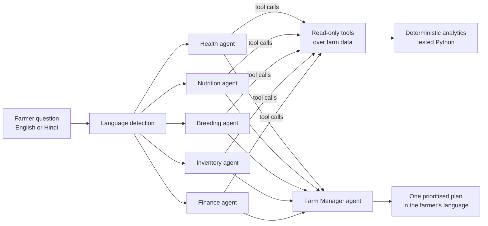

# PashuPlan

**Ask your farm a question. Get a plan, not a dashboard.**

PashuPlan is a multi-agent AI advisor for dairy farmers. A farmer asks something like
*"Milk production has decreased this week"* in English or Hindi. A team of specialist agents
investigates the farm's own data, and a Farm Manager agent turns their findings into one
prioritised action plan.

Built solo for the Reva hackathon, problem statement **Multi-Agent AI for Livestock Farm Decision Support**.


## The problem

A drop in milk is a symptom, and on a real farm it rarely has one cause. A farmer looking at
a falling yield has to separate disease from feed, weather, breeding and stock problems,
usually without a vet or an analyst on hand. A single chatbot tends to guess. PashuPlan
instead makes specialists *look things up* and shows their working.

## What it does

In the demo herd (40 cows, 60 days) milk falls **14.3% in one week**. Four causes are buried in the data:

| Planted cause | Where it shows up | Which agent finds it |
|---|---|---|
| Mastitis in 3 cows (C16, C32, C40) | High somatic cell count, fever, lower rumination | Health |
| A cheaper, lower-protein feed batch | Crude protein 16.6% to 13.8% on 1 Oct | Nutrition |
| A 7-day heat wave | THI peaks at 86, "moderate" heat stress | Nutrition |
| Normal late-lactation decline | Six older cows with low but expected yield | Health (should *not* flag) |

The last row is a deliberate red herring. A good advisor has to leave healthy cows alone.

Beyond the cause, the agents also quantify the damage and the knock-on risks:
- Revenue is down about **Rs 40,700** on the week, and **118 L** of milk is being discarded under antibiotic withdrawal.
- Mastitis tubes will run out in **about 4 days**, in the middle of an outbreak.
- Five cows are overdue for breeding.

## How it works



- **Agents investigate with tools.** Each specialist runs a tool-use loop and chooses what to
  look at, for example `get_cow_detail("C16")`, then reads the result and decides what to check next.
- **The model never does the maths.** Every number comes from deterministic, unit-tested
  functions. The language model decides *what to look at* and *explains it*.
- **Guardrails.** Each agent has its own tool allowlist and a cap of 6 tool turns. Tool errors
  are returned to the model as results, so a bad call never crashes a run. Row counts are capped.
- **Hindi built in.** Language is detected from the question. Answers and the UI follow it, while
  numbers, rupee amounts and cow tags stay in Latin digits so they can't be garbled.

## Status

| Component | State |
|---|---|
| Domain model (THI, Wood's lactation curve, mastitis and fever thresholds, withdrawal periods) | Done |
| Seeded synthetic farm generator with planted causes | Done |
| Analytics layer (9 fact functions) and tool registry with per-agent allowlists | Done |
| English/Hindi strings and language detection | Done |
| Dashboard preview (Streamlit) | Done |
| Agent tool-use loop and Farm Manager orchestration | In progress |
| Hindi UI end to end, offline replay mode | Planned |
| Trained loss-attribution and mastitis early-warning models | Planned |

The project has **69 tests at 99% coverage**, written test-first.

## Quick start

```bash
pip install -r requirements.txt
python -m pytest
streamlit run app.py
```

The dashboard and the tests run without an API key. The agents need an `ANTHROPIC_API_KEY`
environment variable.

## Project layout

```
pashuplan/
  domain.py      Dairy constants and formulas: THI, Wood's curve, SCC and fever thresholds
  data_gen.py    Seeded farm generator that plants the causes and returns the ground truth
  analytics.py   Pure, JSON-safe fact functions the agents read
  tools.py       Tool schemas, per-agent allowlists, and a run_tool() that never raises
  i18n.py        English/Hindi strings, language detection, the model's language instruction
app.py           Streamlit dashboard
tests/           Unit tests for every module
```

## A note on the data

All data is **synthetic**. No real farm records are used. The generator is seeded, so every run
is reproducible, and it records which causes it planted so the analytics can be checked against
a known ground truth. The tests assert that the analytics recover exactly the three planted
mastitis cows, the feed change date, and the heat wave.

## Tech

Python, pandas, NumPy, Streamlit, Plotly, the Anthropic API, pytest.
