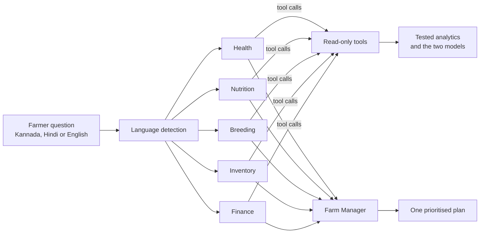

# PashuPlan

**Ask your farm a question. Get a plan, not a dashboard.**

PashuPlan is a multi-agent AI advisor for dairy farmers, built for phones and for people who
may not read much. It opens in **Kannada** by default, with Hindi and English one tap away.
A farmer asks *"Why is my milk going down?"* and gets the answer in plain words: what is wrong,
which cows, how many litres each cause costs, and what to do today, this week and later.

Built solo for the Reva hackathon, problem statement **Multi-Agent AI for Livestock Farm Decision Support**.

## The problem

A drop in milk is a symptom, and on a real farm it rarely has one cause. A farmer has to tell
disease from feed, weather, breeding and stock problems, usually without a vet or an analyst
nearby. A single chatbot tends to guess. PashuPlan makes specialists *look things up*, and
trained models put a number on each cause.

## What it does

In the demo herd (40 simulated cows, 60 days) milk falls **14% in one week**, 122 litres a day.
Four things are buried in the data:

| Planted cause | How it shows up | What PashuPlan reports |
|---|---|---|
| Mastitis in 3 cows (C16, C32, C40) | High SCC, fever, lower rumination | About 18 litres a day lost |
| A cheaper, lower-protein feed batch | Protein 16.6% to 13.8% on 1 Oct | About 47 litres a day lost |
| A 7-day heat wave | THI up to 86 | About 44 litres a day lost |
| Six old cows giving less milk | Normal late lactation | Marked as fine, not sick |

It also finds what a plain rule cannot: **C02 looks healthy today but is showing the first
signs of mastitis**, so the screen says "check this cow today" before she gets sick. And it
spots the money and stock problems: Rs 40,702 less milk income, 118 litres of milk that cannot
be sold during the medicine waiting time, and mastitis medicine that runs out in 4 days.

The screen is designed for low-literacy use: one narrow column, one big number, large type,
numbered steps tagged TODAY, THIS WEEK or LATER, cows drawn as the yellow ear tags they wear,
and no jargon (no THI, no SCC).

## Two models trained from scratch

Both are written in plain NumPy, with no ML framework, trained on simulated farms with
randomized timelines, and judged on farms they never saw. The hero farm is in neither set.

**1. Loss attribution** is a regression of each cow's daily milk (against her lactation curve,
with a separate baseline per cow) on heat, protein shortfall and sickness signals. It answers
"how many litres did each cause cost?". On the hero week it explains 110 of the 122 litres lost
(heat 44, feed 47, sick cows 18, unexplained 12). The effects it learned match the simulator's
true settings: heat 0.0053 per THI point against 0.005 true, feed 0.033 against about 0.032.

**2. Mastitis early warning** is a logistic regression on how far each cow's SCC, temperature,
rumination and milk have moved from her own baseline, compared with her herd mates the same day
so that a heat wave does not look like illness. It predicts mastitis one to two days ahead.
On 5 unseen farms:

| Measure | Result |
|---|---|
| Ranking quality (AUC) | 0.997 |
| Early cases caught (recall) | 92% |
| Flags that were real (precision) | 29% |
| Flags per cow per week | 0.1, about four udder checks a week on 40 cows |

Precision is modest by design: the alert budget is set so a farmer is never sent to check more
than about one cow in ten a week, and most flags are cows a day or two earlier or later than the
label window. On the hero farm it warned about all three sick cows a day before the plain
SCC-and-fever rule, and its watch list is exactly C02.

**These numbers come from simulated data.** The simulator also decides how strong the warning
signs are (rumination drops about 15% before illness), so the metrics show the pipeline works
and recovers known causes, not how it would do on a real farm. Retraining on real farm records
is the next step. `models/metrics.json` holds the full report.

## How the advisor team works



- **Agents investigate with tools.** Each specialist runs a tool-use loop and chooses what to
  look at, such as `get_cow_detail("C16")` or `get_mastitis_risk`, then reads the result.
- **The model never does the maths.** Every number comes from tested functions or the trained
  models. The language model decides what to look at and explains it.
- **Guardrails.** Per-agent tool allowlists, a cap of 6 tool turns (then a forced answer), tool
  errors returned to the model instead of crashing, five advisors run in parallel, and one
  failing advisor never stops the rest.
- **Offline demo.** The last advisor answer is saved and shown with its date when there is no
  key or network.

The on-screen report (causes, actions, money, chart) is built from the analytics and models and
works without an API key. The advisor plan appears when `ANTHROPIC_API_KEY` is set.

## Status

| Component | State |
|---|---|
| Domain model, seeded simulator with planted causes, analytics (9 fact functions) | Done |
| Loss-attribution and mastitis early-warning models, trained and shipped in `models/` | Done |
| Tool registry (11 tools, per-agent allowlists), agent loop, parallel orchestrator | Done, tested with a scripted fake client |
| Phone-first screen in Kannada, Hindi and English | Done |
| First live run against the Anthropic API | Not yet done: needs your API key |
| Real farm data | Not used: everything is simulated |

The project has **192 tests**, written test-first.

## Quick start

```bash
pip install -r requirements.txt
python -m pytest
streamlit run app.py
```

```bash
python -m pashuplan.train        # retrain both models and print held-out metrics
python -m pashuplan.ask          # ask the advisors (needs ANTHROPIC_API_KEY)
python -m pashuplan.ask --lang hi --question "इस हफ्ते दूध कम क्यों हुआ?"
```

## Project layout

```
pashuplan/
  domain.py        Dairy constants and formulas: THI, lactation curve, thresholds
  data_gen.py      Seeded farm simulator; randomized timelines for training
  analytics.py     Pure, JSON-safe fact functions
  features.py      Cow-day features for the models (no lookahead, herd-relative)
  attribution.py   Loss-attribution regression (NumPy)
  risk_model.py    Mastitis early-warning logistic regression (NumPy)
  models.py        Train, evaluate, save and load both models
  tools.py         Tool schemas, per-agent allowlists, run_tool() that never raises
  agents.py        One advisor's tool-use loop
  orchestrator.py  Five advisors in parallel, then the Farm Manager
  report.py        Facts to a plain-language report (causes, actions, money)
  render.py        Report to HTML in Kannada, Hindi or English
  i18n.py          Strings, language detection, language instruction for the model
  ui.css           The look: ear-tag yellow, ink green, Yatra One and Noto Sans Kannada
  replay.py        Saves the last advisor answer for offline demos
  train.py, ask.py Command line entry points
app.py             Streamlit app
models/            Trained model files and metrics.json
tests/             192 tests
```

## A note on the data

All data is **synthetic**. No real farm records are used. The simulator is seeded, so every run
is reproducible, and it records which causes it planted so the analytics and models can be
checked against a known ground truth.

## Tech

Python, pandas, NumPy, Streamlit, the Anthropic API, pytest.
